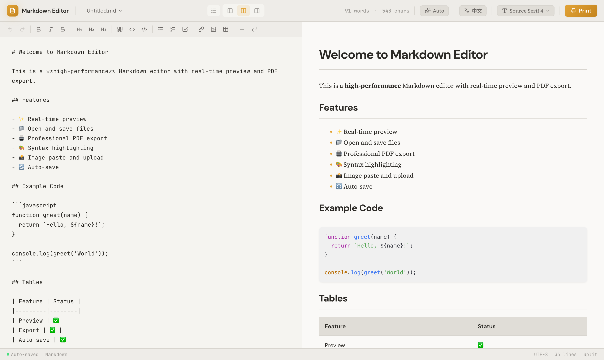
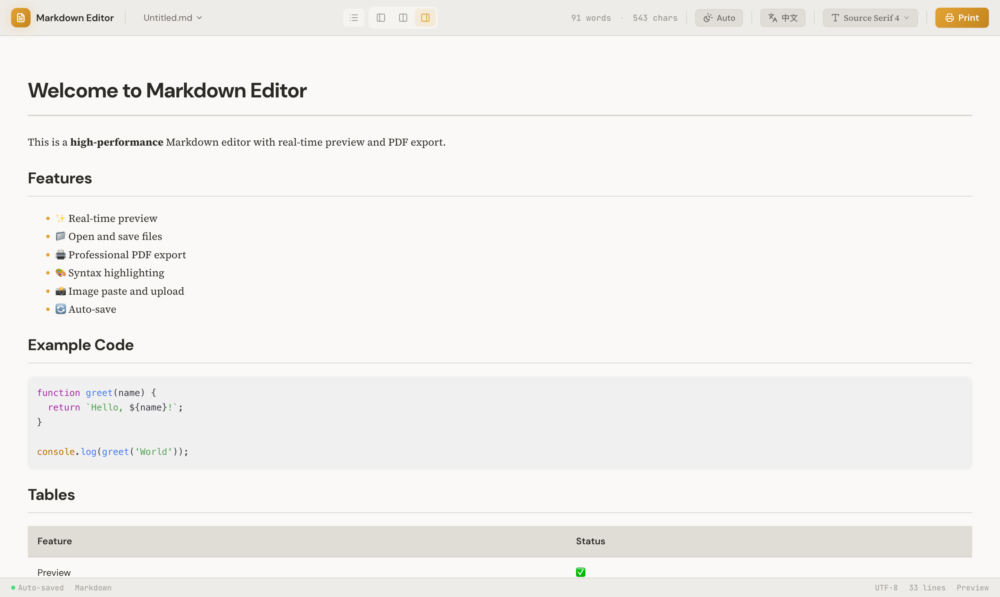
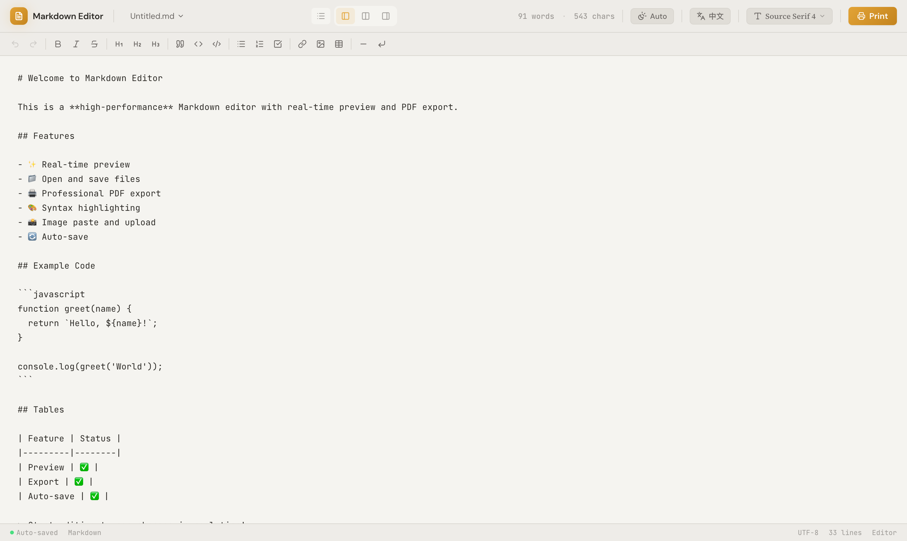
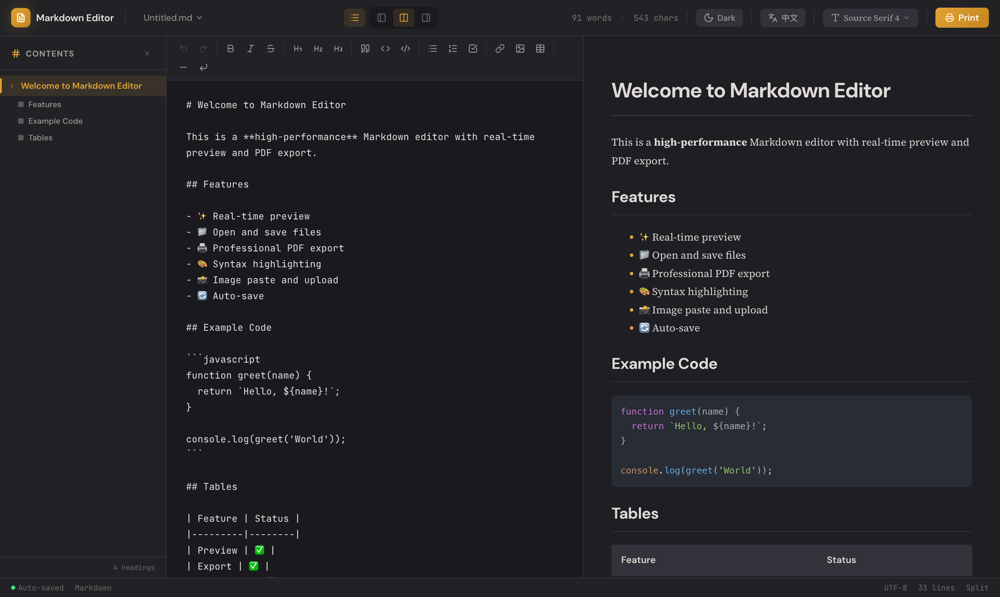
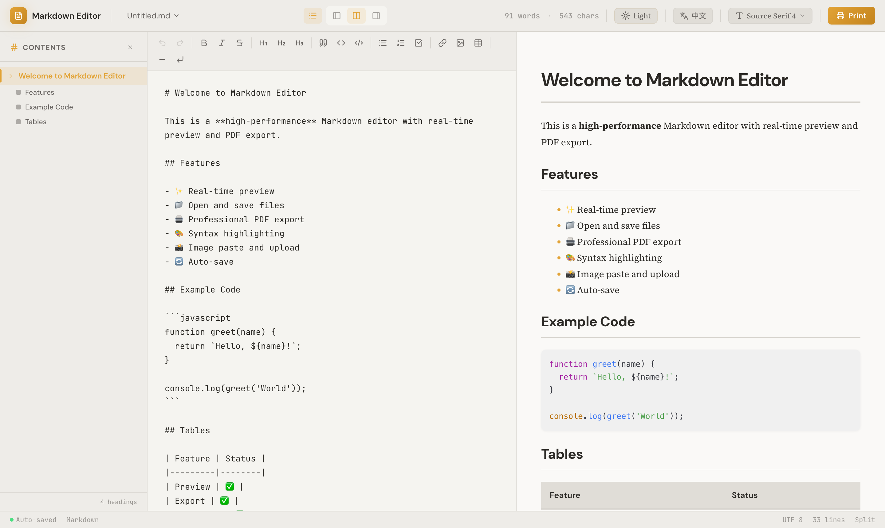

# Markdown Editor

一个极简、高性能的 Web 版 Markdown 编辑器，支持实时预览、多主题切换、目录导航、图片导出和专业的 PDF 打印/导出功能。

🌐 **Live Demo**: [https://sjjliqpl.github.io/markdown-editor/](https://sjjliqpl.github.io/markdown-editor/)

---

## 📸 应用截图

### 分屏视图（默认深色主题）



### 仅预览模式



### 仅编辑模式



### 浅色主题


### 目录面板（浅色）



### 目录面板（深色）



### 中文界面


---

## ✨ 核心特性

| 功能 | 描述 |
|------|------|
| 📝 **实时预览** | 编辑区和预览区实时同步渲染，支持按百分比同步滚动 |
| 🖥️ **三种视图模式** | 分屏视图 / 仅编辑 / 仅预览，可随时切换 |
| 📑 **目录导航** | 自动从文档标题生成目录，点击跳转，高亮当前位置 |
| 📁 **文件操作** | 打开、保存、另存为 `.md` 文件，支持 File System Access API |
| 🖨️ **PDF 导出** | 使用 `jsPDF` + `html2canvas` 直接导出为 PDF 文件，无需打印对话框，优化 A4 分页布局 |
| 🖼️ **图片导出** | 使用 `html2canvas` 将预览区内容导出为高清 PNG 图片 |
| 🎨 **语法高亮** | 基于 `react-syntax-highlighter` 的代码块多语言高亮 |
| 📸 **图片支持** | 支持拖拽上传和 `Ctrl+V` 粘贴图片，自动生成 Markdown 语法 |
| 💾 **自动保存** | 每隔 2 秒自动将内容保存至 `localStorage`，防止内容丢失 |
| 🌙 **三档主题** | 浅色 / 深色 / 跟随系统（Auto），持久化到 `localStorage` |
| 🔤 **字体切换** | 支持多种正文字体（衬线体 / 无衬线体 / 等宽体）切换 |
| 🌍 **国际化** | 中英文界面切换，所有 UI 文案完整翻译 |
| ⌨️ **格式工具栏** | 一键插入加粗、斜体、标题、代码块、表格、链接等格式 |
| ↩️ **撤销/重做** | 完整的编辑历史，支持多步撤销与重做 |
| 📊 **状态栏** | 实时显示词数、字符数、行数和当前视图模式 |
| ♿ **可访问性** | 遵循无障碍设计原则，所有交互元素包含语义标签 |

---

## 🛠️ 技术栈

| 分类 | 技术 |
|------|------|
| **框架** | React 19（函数式组件 + Hooks） |
| **语言** | TypeScript 5（严格类型检查） |
| **构建工具** | Vite 7 |
| **样式** | Tailwind CSS 4 |
| **Markdown 解析** | `react-markdown` + `remark-gfm` (GFM 支持) |
| **语法高亮** | `react-syntax-highlighter` (Prism) |
| **图标** | `lucide-react` |
| **PDF 导出** | `jsPDF` + `html2canvas` |
| **图片导出** | `html2canvas` |
| **性能优化** | `useDeferredValue` + `useTransition` |

---

## 🚀 快速开始

### 安装依赖

```bash
npm install
```

### 开发模式

```bash
npm run dev
```

访问 [http://localhost:5173](http://localhost:5173) 查看应用。

### 构建生产版本

```bash
npm run build
```

构建产物会生成在 `dist` 目录。

### 代码检查

```bash
npm run lint
```

---

## ⌨️ 快捷键

| 快捷键 | 功能 |
|--------|------|
| `Ctrl/Cmd + S` | 保存文件 |
| `Ctrl/Cmd + O` | 打开文件 |
| `Ctrl/Cmd + P` | 导出 PDF 文件 |
| `Ctrl/Cmd + Z` | 撤销 |
| `Ctrl/Cmd + Shift + Z` | 重做 |
| `Ctrl/Cmd + B` | 加粗 |
| `Ctrl/Cmd + I` | 斜体 |

---

## 📚 功能详解

### Markdown 支持

支持完整的 GitHub Flavored Markdown (GFM) 语法，包括：

- **基础排版** - 标题（H1-H6）、段落、加粗、斜体、删除线
- **列表** - 有序列表、无序列表、任务列表（`- [ ]` / `- [x]`）
- **代码** - 行内代码和多语言代码块（语法高亮）
- **表格** - 支持对齐方式（左/中/右）
- **引用块** - 嵌套引用
- **链接与图片** - 行内链接、引用链接、图片
- **扩展语法** - 水平线、脚注、HTML 内嵌

### 视图模式

- **分屏视图** — 编辑区与预览区左右并排，同步滚动
- **仅编辑** — 全屏编辑区，专注写作
- **仅预览** — 全屏预览区，沉浸式阅读

### 目录（TOC）

- 自动解析文档中所有标题层级（H1-H6）生成目录树
- 点击目录项可跳转到对应的预览位置或编辑行
- 当前可视区域的标题在目录中高亮显示

### 图片处理

1. **拖拽上传** — 将图片文件拖入编辑区，自动插入 `` 语法
2. **粘贴上传** — 在编辑区按 `Ctrl/Cmd + V` 粘贴剪贴板中的图片
3. 使用 `URL.createObjectURL` 生成本地对象 URL，无需上传服务器

### PDF 导出

- 使用 `jsPDF` + `html2canvas` 直接将预览内容渲染为 PDF 文件，无需弹出浏览器打印对话框
- 自动按 A4 尺寸分页，每页留 20mm 边距
- 支持多页长文档自动分割，保证内容连续
- 导出文件名格式：`{文件名}.pdf`

### 图片导出（PNG）

- 使用 `html2canvas` 将完整预览区截为 2× 高清 PNG
- 支持深色/浅色背景，自动匹配当前主题背景色
- 导出文件名格式：`{文件名}.png`

### 文件操作

| 操作 | 描述 |
|------|------|
| **打开** | 优先使用 File System Access API；浏览器不支持时降级为 `<input type="file">` |
| **保存** | 保存到当前已打开的文件句柄 |
| **另存为** | 弹出文件保存对话框，默认文件名含日期（如 `Untitled_20260228.md`） |
| **自动保存** | 每 2 秒将内容保存至 `localStorage`，刷新后自动恢复 |

### 主题与字体

- 主题模式：**浅色** / **深色** / **Auto**（跟随系统 `prefers-color-scheme`）
- 字体选项：衬线字体（Source Serif 4）、无衬线字体、等宽字体
- 所有偏好设置持久化存储至 `localStorage`

---

## 📁 项目结构

```
src/
├── components/
│   ├── Editor.tsx              # 主编辑器容器（状态管理、布局）
│   ├── FormatToolbar.tsx       # Markdown 格式工具栏
│   ├── MarkdownEditor.tsx      # 左侧编辑区（textarea + 行号）
│   ├── MarkdownPreview.tsx     # 右侧预览区（react-markdown 渲染）
│   ├── TableOfContents.tsx     # 目录面板
│   └── Toolbar.tsx             # 顶部工具栏（文件、视图、主题、语言）
├── hooks/
│   ├── useAutoSave.ts          # localStorage 自动保存
│   ├── useFileSystem.ts        # 文件打开/保存（File System Access API）
│   ├── useFontFamily.ts        # 字体偏好管理
│   ├── useHistory.ts           # 编辑历史（撤销/重做）
│   ├── useLocale.ts            # 国际化语言切换
│   ├── useTheme.ts             # 主题（浅色/深色/Auto）
│   └── useToc.ts               # 目录项解析
├── i18n.ts                     # 中英文翻译字典
├── index.css                   # 全局样式 & CSS 变量（主题 tokens）
├── print.css                   # 打印 / PDF 导出专用样式
├── App.tsx                     # 根组件
└── main.tsx                    # 应用入口
```

---

## 🎯 设计原则

1. **极简设计** — 简洁的界面，专注于内容创作，无多余干扰
2. **高性能** — `useDeferredValue` + `useTransition` 优化大文件渲染，防止输入卡顿
3. **渐进增强** — File System Access API 优先，优雅降级至传统 `<input>` 方案
4. **逻辑分离** — 所有业务逻辑封装为独立 Hook，视图组件保持纯粹
5. **专业导出** — 遵循 CSS Paged Media 规范，保证 PDF 打印质量

---

## 📝 License

MIT
