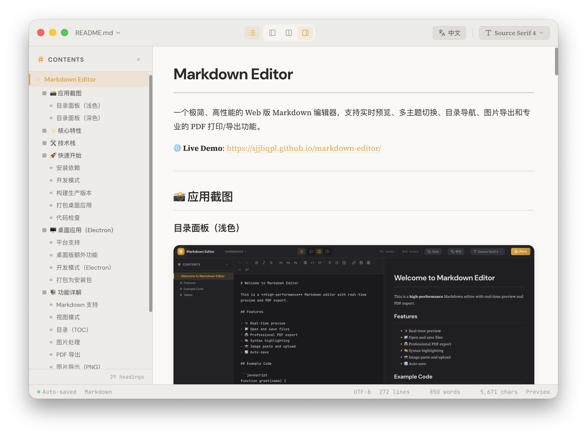
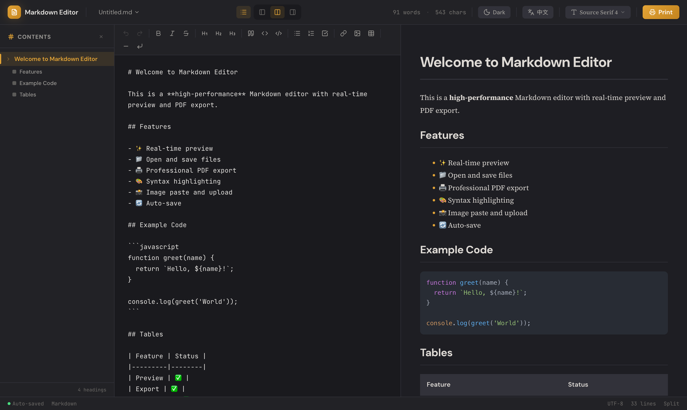
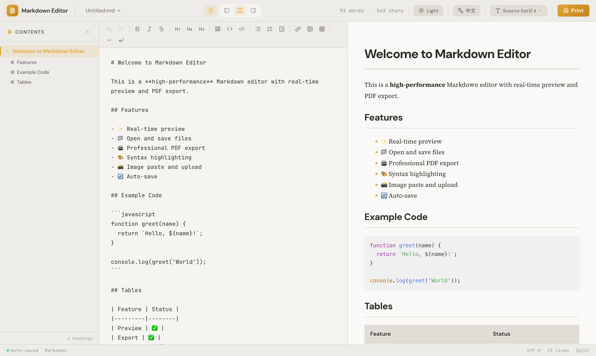

# Markdown Editor

一个极简、高性能的 Markdown 编辑器，支持实时预览、多主题切换、目录导航、图片处理和 PDF 导出。

🌐 **Live Demo**: [https://sjjliqpl.github.io/markdown-editor/](https://sjjliqpl.github.io/markdown-editor/)

---

## 📸 应用截图

### 桌面应用（Tauri）



### 目录面板（浅色）



### 目录面板（深色）



---

## ✨ 核心特性

| 功能 | 描述 |
|------|------|
| 📝 **实时预览** | 编辑区和预览区实时同步渲染，支持按百分比同步滚动 |
| 🖥️ **三种视图模式** | 分屏视图 / 仅编辑 / 仅预览，可随时切换 |
| 📑 **目录导航** | 自动从文档标题生成目录，点击跳转，高亮当前位置 |
| 📁 **文件操作** | 打开、保存、另存为 `.md` 文件，原生文件对话框 |
| 🖨️ **PDF 导出** | 桌面端调用系统打印对话框（可"存储为 PDF"）；Web 端使用 jsPDF 直接导出 |
| 🖼️ **图片导出** | 桌面端调用系统打印；Web 端使用 html2canvas 导出高清 PNG |
| 🎨 **语法高亮** | 基于 `react-syntax-highlighter` 的代码块多语言高亮 |
| 📸 **图片支持** | 支持拖拽上传和粘贴图片，自动生成 Markdown 语法；桌面端本地图片通过 `asset://` 协议显示 |
| 💾 **自动保存** | 每隔 2 秒自动将内容保存至 `localStorage`，防止内容丢失 |
| 🌙 **主题自适应** | 自动跟随系统 `prefers-color-scheme`，无需手动切换 |
| 🔤 **字体切换** | 支持多种正文字体（衬线体 / 无衬线体 / 等宽体）切换 |
| 🌍 **国际化** | 中英文界面切换，所有 UI 文案完整翻译 |
| ⌨️ **格式工具栏** | 一键插入加粗、斜体、标题、代码块、表格、链接等格式 |
| ↩️ **撤销/重做** | 完整的编辑历史，支持多步撤销与重做 |
| 📊 **状态栏** | 实时显示词数、字符数、行数和当前视图模式 |
| ♿ **可访问性** | 遵循无障碍设计原则，所有交互元素包含语义标签 |

---

## 🛠️ 技术栈

| 分类 | 技术 |
|------|------|
| **框架** | React 19（函数式组件 + Hooks） |
| **语言** | TypeScript 5（严格类型检查） |
| **构建工具** | Vite 7 |
| **样式** | Tailwind CSS 4 |
| **Markdown 解析** | `react-markdown` + `remark-gfm` (GFM 支持) |
| **语法高亮** | `react-syntax-highlighter` (Prism) |
| **图标** | `lucide-react` |
| **PDF/图片导出（Web）** | `jsPDF` + `html2canvas` |
| **桌面应用** | **Tauri 2** + Rust 后端（macOS arm64，4.3 MB DMG） |
| **性能优化** | `useDeferredValue` + `useTransition` |

---

## 🚀 快速开始

### 安装依赖

```bash
npm install
```

> 桌面端开发还需要安装 [Rust](https://rustup.rs/) 工具链。

### Web 开发模式

```bash
npm run dev
```

访问 [http://localhost:5173](http://localhost:5173) 查看应用。

### Web 生产构建

```bash
npm run build
```

构建产物输出到 `dist/` 目录。

### 桌面应用开发模式（Tauri）

```bash
npm run tauri:dev
```

同时启动 Vite 开发服务器和 Tauri 窗口，支持热更新。

### 打包桌面安装包（Tauri）

```bash
npm run tauri:build
```

打包产物输出到 `src-tauri/target/aarch64-apple-darwin/release/bundle/`：

```
src-tauri/target/aarch64-apple-darwin/release/bundle/
├── macos/
│   └── Markdown Editor.app           # 应用程序包
└── dmg/
    └── Markdown Editor_1.0.0_aarch64.dmg  # macOS 安装镜像（~4.3 MB）
```

### 代码检查

```bash
npm run lint
```

---

## 🖥️ 桌面应用（Tauri）

本项目使用 **Tauri 2** 构建原生桌面应用，相比 Electron 体积大幅缩小：

| | Electron | Tauri |
|---|---|---|
| DMG 大小 | ~112 MB | **~4.3 MB** |
| 技术原理 | 内置 Chromium + Node.js | 使用系统 WebView（WKWebView）+ Rust 后端 |
| 构建时间 | 快 | 首次较慢（需编译 Rust），增量编译快 |

### 系统要求

- **macOS 11.0+**（Big Sur 或更高版本）
- **Apple Silicon (arm64)**（当前构建目标）
- Rust 1.70+（仅开发时需要）

### 桌面版额外功能

- **原生文件对话框** — 打开/保存使用系统原生对话框，支持完整文件路径管理
- **原生应用菜单** — File / Edit / View / Window 标准菜单，快捷键完整支持
- **macOS 沉浸式标题栏** — Overlay 样式，贴合 macOS 设计规范
- **文件关联** — `.md`、`.markdown`、`.txt` 文件可直接用本应用打开
- **单实例** — 重复打开时聚焦已有窗口
- **本地图片显示** — 通过 `asset://` 协议加载 Markdown 中引用的本地图片

### 导出说明

| 功能 | Web 模式 | 桌面模式（Tauri） |
|------|---------|----------------|
| 导出 PDF | jsPDF 直接生成 `.pdf` 文件 | 调用系统打印对话框，选"存储为 PDF" |
| 导出图片 | html2canvas 生成 `.png` 文件 | 调用系统打印对话框，可打印或存储 |

---

## ⌨️ 快捷键

| 快捷键 | 功能 |
|--------|------|
| `Cmd + S` | 保存文件 |
| `Cmd + O` | 打开文件 |
| `Cmd + P` | 导出 PDF / 打印 |
| `Cmd + Shift + S` | 另存为 |
| `Cmd + Z` | 撤销 |
| `Cmd + Shift + Z` | 重做 |
| `Cmd + B` | 加粗 |
| `Cmd + I` | 斜体 |

---

## 📚 功能详解

### Markdown 支持

支持完整的 GitHub Flavored Markdown (GFM) 语法，包括：

- **基础排版** — 标题（H1-H6）、段落、加粗、斜体、删除线
- **列表** — 有序列表、无序列表、任务列表（`- [ ]` / `- [x]`）
- **代码** — 行内代码和多语言代码块（语法高亮）
- **表格** — 支持对齐方式（左/中/右）
- **引用块** — 嵌套引用
- **链接与图片** — 行内链接、引用链接、图片（桌面端支持本地路径）
- **扩展语法** — 水平线、HTML 内嵌

### 视图模式

- **分屏视图** — 编辑区与预览区左右并排，同步滚动
- **仅编辑** — 全屏编辑区，专注写作
- **仅预览** — 全屏预览区，沉浸式阅读

> 桌面端打开文件后会自动切换到预览模式并展开目录。

### 目录（TOC）

- 自动解析文档中所有标题层级（H1-H6）生成目录树
- 点击目录项可跳转到对应的预览位置或编辑行
- 当前可视区域的标题在目录中高亮显示

### 图片处理

1. **拖拽上传** — 将图片文件拖入编辑区，自动插入 `` 语法
2. **粘贴上传** — 在编辑区按 `Cmd + V` 粘贴剪贴板中的图片
3. **本地图片显示**（桌面端）— 通过 `asset://localhost/...` 协议加载 Markdown 文件同目录下的相对路径图片

### 文件操作

| 操作 | 桌面端 | Web 端 |
|------|--------|--------|
| **打开** | 原生系统文件对话框 | File System Access API / `<input>` 降级 |
| **保存** | 直接写入原始文件路径 | 写入文件句柄 |
| **另存为** | 原生系统保存对话框 | 浏览器下载 |
| **自动保存** | localStorage 暂存 | localStorage 暂存 |

### 主题与字体

- 主题：**自动跟随系统**（`prefers-color-scheme`），实时响应深色/浅色切换
- 字体选项：衬线字体、无衬线字体、等宽字体（多种中英文字体）
- 所有偏好设置持久化存储至 `localStorage`

---

## 📁 项目结构

```
src-tauri/
├── src/
│   ├── lib.rs              # Rust 后端（文件 I/O 命令、原生菜单、单实例）
│   └── main.rs             # 入口点
├── capabilities/
│   └── default.json        # Tauri 插件权限声明
└── tauri.conf.json         # Tauri 配置（窗口、bundle、文件关联、asset 协议）
src/
├── components/
│   ├── Editor.tsx          # 主编辑器容器（状态管理、布局）
│   ├── FormatToolbar.tsx   # Markdown 格式工具栏
│   ├── MarkdownEditor.tsx  # 左侧编辑区（textarea + 行号）
│   ├── MarkdownPreview.tsx # 右侧预览区（react-markdown 渲染）
│   ├── TableOfContents.tsx # 目录面板
│   └── Toolbar.tsx         # 顶部工具栏（文件、视图、主题、语言）
├── hooks/
│   ├── useAutoSave.ts      # localStorage 自动保存
│   ├── useFileSystem.ts    # 文件打开/保存（Tauri / File System Access API）
│   ├── useFontFamily.ts    # 字体偏好管理
│   ├── useHistory.ts       # 编辑历史（撤销/重做）
│   ├── useLocale.ts        # 国际化语言切换
│   ├── useTheme.ts         # 主题（浅色/深色/Auto）
│   └── useToc.ts           # 目录项解析
├── lib/
│   └── appAPI.ts           # 统一 IPC 层（Tauri / Electron 运行时检测）
├── i18n.ts                 # 中英文翻译字典
├── index.css               # 全局样式 & CSS 变量（主题 tokens）
├── print.css               # 打印 / PDF 导出专用样式
├── App.tsx                 # 根组件
└── main.tsx                # 应用入口
electron/                   # Electron 遗留后端（保留兼容）
```

---

## 🎯 设计原则

1. **极简设计** — 简洁的界面，专注于内容创作，无多余干扰
2. **高性能** — `useDeferredValue` + `useTransition` 优化大文件渲染，防止输入卡顿
3. **渐进增强** — 桌面优先原生 API，Web 端优雅降级
4. **逻辑分离** — 所有业务逻辑封装为独立 Hook，视图组件保持纯粹
5. **极致体积** — Tauri 利用系统 WebView，DMG 仅 4.3 MB

---

## 📝 License

MIT

